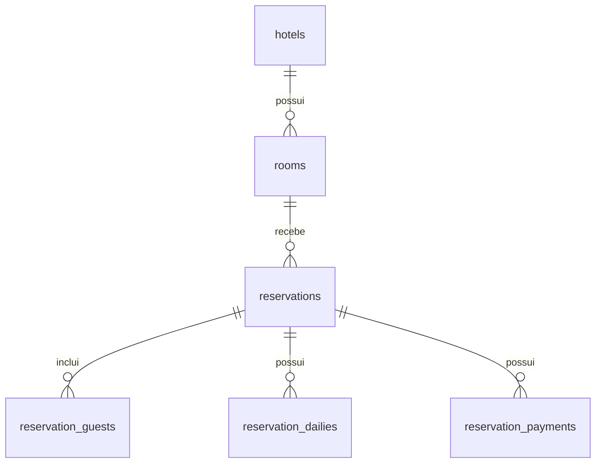

# Modelagem do banco de dados

A estrutura foi definida a partir dos arquivos hotels.xml, rooms.xml
e reserves.xml. As migrations em database/migrations permitem
reproduzir a estrutura do banco.

## Tabelas

Todas as tabelas possuem id como chave primária e os campos
created_at e updated_at.

| Tabela | Campos específicos |
|---|---|
| hotels | external_id, name |
| rooms | external_id, hotel_id, name |
| reservations | external_id, room_id, check_in, check_out, total |
| reservation_guests | reservation_id, name, last_name, phone |
| reservation_dailies | reservation_id, date, value |
| reservation_payments | reservation_id, method, value |

## Relacionamentos

## Identificadores de origem

Os campos external_id de hotels, rooms e reservations guardam os
atributos id recebidos nos XMLs. São únicos em cada tabela e podem
ser nulos para registros criados diretamente pela aplicação.

Os relacionamentos internos utilizam as chaves primárias do banco:

- Room.hotelCode identifica o external_id do hotel.
- Reserve.roomCode identifica o external_id do quarto.
- Reserve.hotelCode deve corresponder ao hotel do quarto informado.

O hotel de uma reserva é obtido pelo relacionamento com o quarto.

## Decisões de modelagem

- Datas são armazenadas como DATE.
- Valores monetários são armazenados como DECIMAL(12, 2).
- Telefones são armazenados como texto.
- Os hóspedes são registrados por reserva, preservando os dados
  recebidos naquela hospedagem.
- Uma reserva pode ter vários hóspedes, diárias e pagamentos.
- A combinação de reserva e data da diária é única.
- Uma reserva sem pagamentos não possui registros em
  reservation_payments.
- O campo method preserva o código numérico recebido no XML.
  O significado do código 1 não foi informado nos arquivos.
- A exclusão de hotéis com quartos é bloqueada.
- A exclusão de quartos com reservas é bloqueada.
- A exclusão de uma reserva remove seus hóspedes, diárias e
  pagamentos vinculados.

## Inconsistência identificada na origem

A reserva de código 6 possui check-in em 2022-10-01 e check-out
em 2022-10-04, mas uma diária está datada de 2022-12-03.

Essa diária está fora do período da hospedagem. O tratamento será
implementado e documentado na etapa de importação, sem corrigir
silenciosamente o arquivo original.